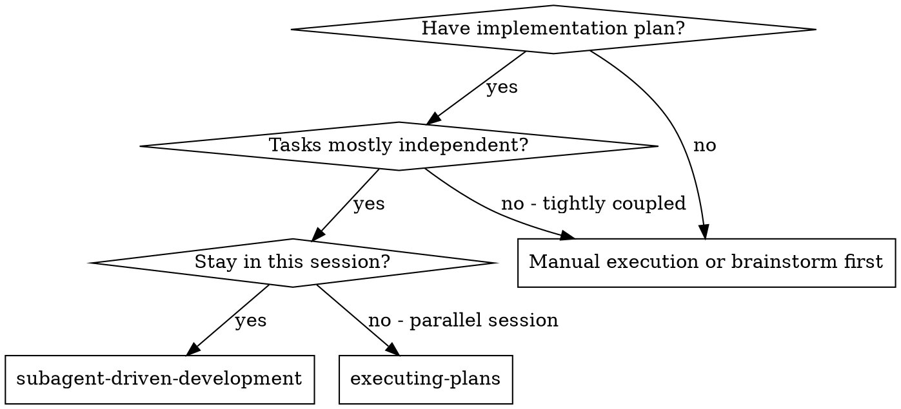

# Subagent-Driven Development

Execute plan by dispatching fresh subagent per task, with two-stage review after each: spec compliance review first, then code quality review.

**Core principle:** Fresh subagent per task + two-stage review (spec then quality) = high quality, fast iteration

## Model Selection

Decide model before spawning the implementer subagent. Default to the cheapest model that is likely to succeed.

- **Simple fixes** (single-file edits, small configs, doc tweaks): run `claude-zai -p <prompt>`
- **Medium tasks** (multi-file changes, new tests, moderate refactors): run `claude --model claude-sonnet-4-5 -p <prompt>`
- **Complex tasks** (new features, cross-cutting changes, tricky debugging): run `claude --model claude-opus-4-5 -p <prompt>`
- **Reviews** (spec reviewer, code quality reviewer, final reviewer): always run `codex -m gpt-5.2 exec <prompt>` or `codex review`

## When to Use



**vs. Executing Plans (parallel session):**
- Same session (no context switch)
- Fresh subagent per task (no context pollution)
- Two-stage review after each task: spec compliance first, then code quality
- Faster iteration (no human-in-loop between tasks)

## The Process

```dot
digraph process {
    rankdir=TB;

    subgraph cluster_per_task {
        label="Per Task";
        "Create implementer prompt file (.ai_agents/coding-agent-prompts/...) using ./implementer-prompt.md" [shape=box];
        "Spawn implementer subagent (choose model per complexity; see Model Selection)" [shape=box];
        "Implementer subagent asks questions?" [shape=diamond];
        "Answer questions, provide context" [shape=box];
        "Implementer subagent implements, tests, commits, self-reviews" [shape=box];
        "Dispatch spec reviewer subagent (./spec-reviewer-prompt.md)" [shape=box];
        "Spec reviewer subagent confirms code matches spec?" [shape=diamond];
        "Implementer subagent fixes spec gaps" [shape=box];
        "Dispatch code quality reviewer subagent (./code-quality-reviewer-prompt.md)" [shape=box];
        "Code quality reviewer subagent approves?" [shape=diamond];
        "Implementer subagent fixes quality issues" [shape=box];
        "Confirm agent summary in .ai_agents/session_context/{todaysdate}/task-{taskid}.md" [shape=box];
        "Mark task complete in TodoWrite" [shape=box];
    }

    "Load orchestrator prompt [shape=box];
    "Read plan, extract all tasks with full text, note context, create TodoWrite" [shape=box];
    "More tasks remain?" [shape=diamond];
    "Stop and report failure after 10 iterations" [shape=box];
    "Dispatch final code reviewer subagent for entire implementation" [shape=box];
    "Use superpowers:finishing-a-development-branch" [shape=box style=filled fillcolor=lightgreen];

    "Load orchestrator prompt  -> "Read plan, extract all tasks with full text, note context, create TodoWrite";
    "Read plan, extract all tasks with full text, note context, create TodoWrite" -> "Create implementer prompt file (.ai_agents/coding-agent-prompts/...) using ./implementer-prompt.md";
    "Create implementer prompt file (.ai_agents/coding-agent-prompts/...) using ./implementer-prompt.md" -> "Spawn implementer subagent (choose model per complexity; see Model Selection)";
    "Spawn implementer subagent (choose model per complexity; see Model Selection)" -> "Implementer subagent asks questions?";
    "Implementer subagent asks questions?" -> "Answer questions, provide context" [label="yes"];
    "Answer questions, provide context" -> "Create implementer prompt file (.ai_agents/coding-agent-prompts/...) using ./implementer-prompt.md" [label="update prompt"];
    "Implementer subagent asks questions?" -> "Implementer subagent implements, tests, commits, self-reviews" [label="no"];
    "Implementer subagent implements, tests, commits, self-reviews" -> "Dispatch spec reviewer subagent (./spec-reviewer-prompt.md)";
    "Dispatch spec reviewer subagent (./spec-reviewer-prompt.md)" -> "Spec reviewer subagent confirms code matches spec?";
    "Spec reviewer subagent confirms code matches spec?" -> "Implementer subagent fixes spec gaps" [label="no"];
    "Implementer subagent fixes spec gaps" -> "Dispatch spec reviewer subagent (./spec-reviewer-prompt.md)" [label="re-review"];
    "Implementer subagent fixes spec gaps" -> "Stop and report failure after 10 iterations" [label="if >10 loops"];
    "Spec reviewer subagent confirms code matches spec?" -> "Dispatch code quality reviewer subagent (./code-quality-reviewer-prompt.md)" [label="yes"];
    "Dispatch code quality reviewer subagent (./code-quality-reviewer-prompt.md)" -> "Code quality reviewer subagent approves?";
    "Code quality reviewer subagent approves?" -> "Implementer subagent fixes quality issues" [label="no"];
    "Implementer subagent fixes quality issues" -> "Dispatch code quality reviewer subagent (./code-quality-reviewer-prompt.md)" [label="re-review"];
    "Implementer subagent fixes quality issues" -> "Stop and report failure after 10 iterations" [label="if >10 loops"];
    "Code quality reviewer subagent approves?" -> "Confirm agent summary in .ai_agents/session_context/{todaysdate}/task-{taskid}.md" [label="yes"];
    "Confirm agent summary in .ai_agents/session_context/{todaysdate}/task-{taskid}.md" -> "Mark task complete in TodoWrite";
    "Mark task complete in TodoWrite" -> "More tasks remain?";
    "More tasks remain?" -> "Create implementer prompt file (.ai_agents/coding-agent-prompts/...) using ./implementer-prompt.md" [label="yes"];
    "More tasks remain?" -> "Dispatch final code reviewer subagent for entire implementation" [label="no"];
    "Dispatch final code reviewer subagent for entire implementation" -> "Use superpowers:finishing-a-development-branch";
}
```

## Prompt Templates

- `./implementer-prompt.md` - Dispatch implementer subagent
- `./spec-reviewer-prompt.md` - Dispatch spec compliance reviewer subagent
- `./code-quality-reviewer-prompt.md` - Dispatch code quality reviewer subagent

## Orchestrator Prompt (Required)

Treat the implementer subagent as the coding agent in that loop, and use the reviewer prompts for the spec and code quality review steps.

**Do:**
- Create a detailed, decision-complete prompt for each task and save it in `.ai_agents/session_context/{todaysdate}/coding-agent-prompts/`
- Select the implementer model based on task complexity (see Model Selection) and allow a long timeout of around 30 minutes
- Run all reviewer subagents (spec, code quality, final review) with `codex -m gpt-5.2 exec <prompt>`
- Review the agent's work; if it drifts or misses requirements, send a new prompt and re-run until it meets the spec
- Require the agent to write a summary, files touched, and changes in `.ai_agents/session_context/{todaysdate}/task-{taskid}.md`
- Update your TodoWrite (or external task list) and mark the task complete before moving on

**Stop condition:**
- If the agent fails to meet requirements after 10 iterations, stop the loop and report the failure to the user

## References

- `references/example-workflow.md` - Full end-to-end example with orchestration loop and reviews

## Advantages

**vs. Manual execution:**
- Subagents follow TDD naturally
- Fresh context per task (no confusion)
- Parallel-safe (subagents don't interfere)
- Subagent can ask questions (before AND during work)

**vs. Executing Plans:**
- Same session (no handoff)
- Continuous progress (no waiting)
- Review checkpoints automatic

**Efficiency gains:**
- No file reading overhead (controller provides full text)
- Controller curates exactly what context is needed
- Subagent gets complete information upfront
- Questions surfaced before work begins (not after)

**Quality gates:**
- Self-review catches issues before handoff
- Two-stage review: spec compliance, then code quality
- Review loops ensure fixes actually work
- Spec compliance prevents over/under-building
- Code quality ensures implementation is well-built

**Cost:**
- More subagent invocations (implementer + 2 reviewers per task)
- Controller does more prep work (extracting all tasks upfront)
- Review loops add iterations
- But catches issues early (cheaper than debugging later)

## Red Flags

**Never:**
- Skip reviews (spec compliance OR code quality)
- Proceed with unfixed issues
- Dispatch multiple implementation subagents in parallel (conflicts)
- Make subagent read plan file (provide full text instead)
- Skip scene-setting context (subagent needs to understand where task fits)
- Ignore subagent questions (answer before letting them proceed)
- Accept "close enough" on spec compliance (spec reviewer found issues = not done)
- Skip review loops (reviewer found issues = implementer fixes = review again)
- Let implementer self-review replace actual review (both are needed)
- **Start code quality review before spec compliance is ✅** (wrong order)
- Move to next task while either review has open issues

**If subagent asks questions:**
- Answer clearly and completely
- Provide additional context if needed
- Don't rush them into implementation

**If reviewer finds issues:**
- Implementer (same subagent) fixes them
- Reviewer reviews again
- Repeat until approved
- Don't skip the re-review

**If subagent fails task:**
- Dispatch fix subagent with specific instructions
- Don't try to fix manually (context pollution)

## Integration

**Required workflow skills:**
- **superpowers:writing-plans** - Creates the plan this skill executes
- **superpowers:requesting-code-review** - Code review template for reviewer subagents
- **superpowers:finishing-a-development-branch** - Complete development after all tasks

**Subagents should use:**
- **superpowers:test-driven-development** - Subagents follow TDD for each task
