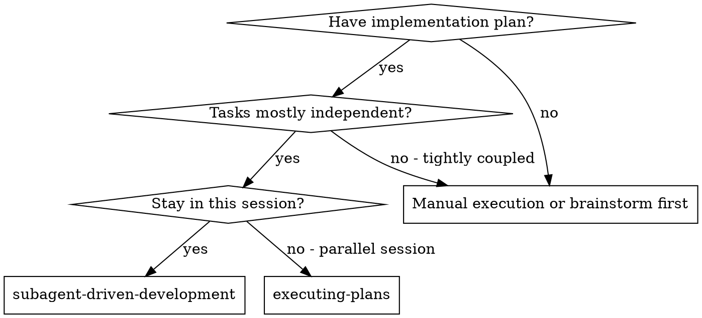
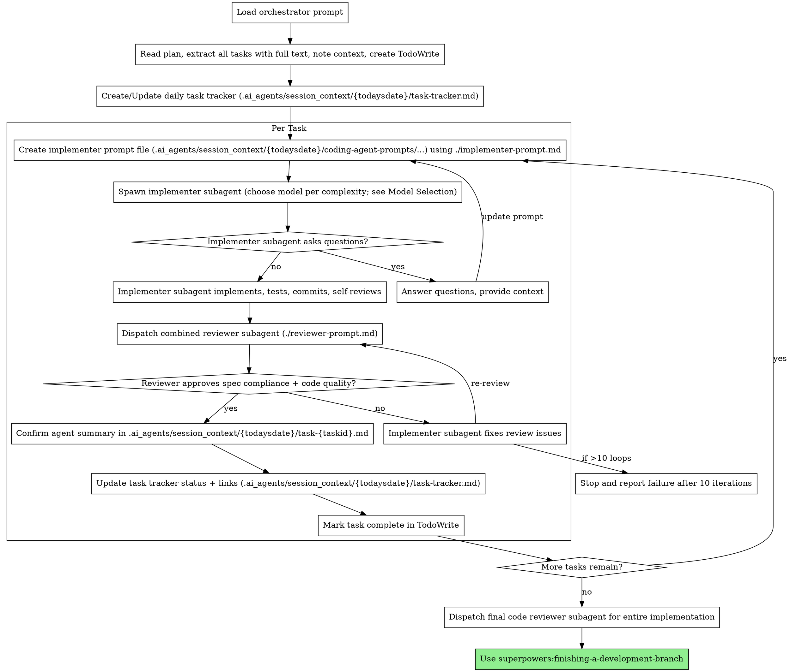

# DOT Graphs (Optional)

Use these for human reference only. The rule list in `SKILL.md` is the source of truth for LLMs.

## When to Use

```dot
digraph when_to_use {
    "Have implementation plan?" [shape=diamond];
    "Tasks mostly independent?" [shape=diamond];
    "Stay in this session?" [shape=diamond];
    "subagent-driven-development" [shape=box];
    "executing-plans" [shape=box];
    "Manual execution or brainstorm first" [shape=box];

    "Have implementation plan?" -> "Tasks mostly independent?" [label="yes"];
    "Have implementation plan?" -> "Manual execution or brainstorm first" [label="no"];
    "Tasks mostly independent?" -> "Stay in this session?" [label="yes"];
    "Tasks mostly independent?" -> "Manual execution or brainstorm first" [label="no - tightly coupled"];
    "Stay in this session?" -> "subagent-driven-development" [label="yes"];
    "Stay in this session?" -> "executing-plans" [label="no - parallel session"];
}
```

## Process

```dot
digraph process {
    rankdir=TB;

    subgraph cluster_per_task {
        label="Per Task";
        "Create implementer prompt file (.ai_agents/session_context/{todaysdate}/coding-agent-prompts/...) using ./implementer-prompt.md" [shape=box];
        "Spawn implementer subagent (choose model per complexity; see Model Selection)" [shape=box];
        "Implementer subagent asks questions?" [shape=diamond];
        "Answer questions, provide context" [shape=box];
        "Implementer subagent implements, tests, commits, self-reviews" [shape=box];
        "Dispatch combined reviewer subagent (./reviewer-prompt.md)" [shape=box];
        "Reviewer approves spec compliance + code quality?" [shape=diamond];
        "Implementer subagent fixes review issues" [shape=box];
        "Confirm agent summary in .ai_agents/session_context/{todaysdate}/task-{taskid}.md" [shape=box];
        "Update task tracker status + links (.ai_agents/session_context/{todaysdate}/task-tracker.md)" [shape=box];
        "Mark task complete in TodoWrite" [shape=box];
    }

    "Load orchestrator prompt" [shape=box];
    "Read plan, extract all tasks with full text, note context, create TodoWrite" [shape=box];
    "Create/Update daily task tracker (.ai_agents/session_context/{todaysdate}/task-tracker.md)" [shape=box];
    "More tasks remain?" [shape=diamond];
    "Stop and report failure after 10 iterations" [shape=box];
    "Dispatch final code reviewer subagent for entire implementation" [shape=box];
    "Use superpowers:finishing-a-development-branch" [shape=box style=filled fillcolor=lightgreen];

    "Load orchestrator prompt" -> "Read plan, extract all tasks with full text, note context, create TodoWrite";
    "Read plan, extract all tasks with full text, note context, create TodoWrite" -> "Create/Update daily task tracker (.ai_agents/session_context/{todaysdate}/task-tracker.md)";
    "Create/Update daily task tracker (.ai_agents/session_context/{todaysdate}/task-tracker.md)" -> "Create implementer prompt file (.ai_agents/session_context/{todaysdate}/coding-agent-prompts/...) using ./implementer-prompt.md";
    "Create implementer prompt file (.ai_agents/session_context/{todaysdate}/coding-agent-prompts/...) using ./implementer-prompt.md" -> "Spawn implementer subagent (choose model per complexity; see Model Selection)";
    "Spawn implementer subagent (choose model per complexity; see Model Selection)" -> "Implementer subagent asks questions?";
    "Implementer subagent asks questions?" -> "Answer questions, provide context" [label="yes"];
    "Answer questions, provide context" -> "Create implementer prompt file (.ai_agents/session_context/{todaysdate}/coding-agent-prompts/...) using ./implementer-prompt.md" [label="update prompt"];
    "Implementer subagent asks questions?" -> "Implementer subagent implements, tests, commits, self-reviews" [label="no"];
    "Implementer subagent implements, tests, commits, self-reviews" -> "Dispatch combined reviewer subagent (./reviewer-prompt.md)";
    "Dispatch combined reviewer subagent (./reviewer-prompt.md)" -> "Reviewer approves spec compliance + code quality?";
    "Reviewer approves spec compliance + code quality?" -> "Implementer subagent fixes review issues" [label="no"];
    "Implementer subagent fixes review issues" -> "Dispatch combined reviewer subagent (./reviewer-prompt.md)" [label="re-review"];
    "Implementer subagent fixes review issues" -> "Stop and report failure after 10 iterations" [label="if >10 loops"];
    "Reviewer approves spec compliance + code quality?" -> "Confirm agent summary in .ai_agents/session_context/{todaysdate}/task-{taskid}.md" [label="yes"];
    "Confirm agent summary in .ai_agents/session_context/{todaysdate}/task-{taskid}.md" -> "Update task tracker status + links (.ai_agents/session_context/{todaysdate}/task-tracker.md)";
    "Update task tracker status + links (.ai_agents/session_context/{todaysdate}/task-tracker.md)" -> "Mark task complete in TodoWrite";
    "Mark task complete in TodoWrite" -> "More tasks remain?";
    "More tasks remain?" -> "Create implementer prompt file (.ai_agents/session_context/{todaysdate}/coding-agent-prompts/...) using ./implementer-prompt.md" [label="yes"];
    "More tasks remain?" -> "Dispatch final code reviewer subagent for entire implementation" [label="no"];
    "Dispatch final code reviewer subagent for entire implementation" -> "Use superpowers:finishing-a-development-branch";
}
```
